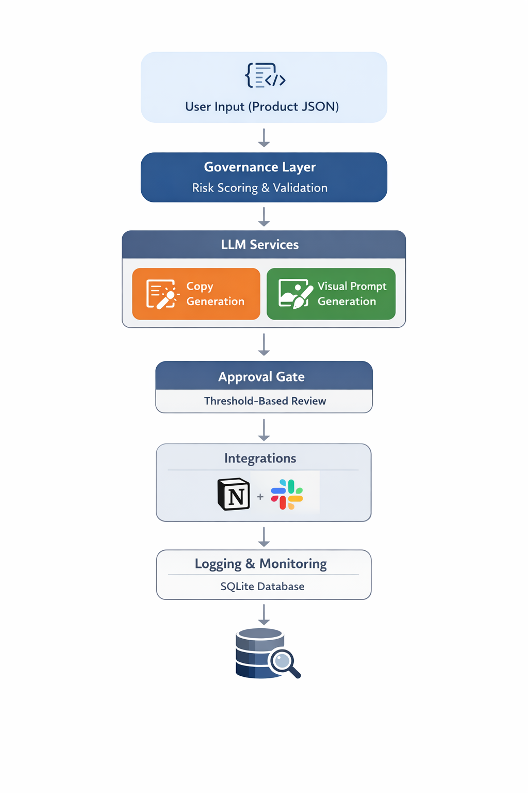

# 🚀 Enterprise-Grade Generative AI System Design for Fashion Retail

A progressive suite of Generative AI prototypes evolving from isolated LLM use cases into a governed, multi-layer AI experimentation and automation platform for enterprise fashion retail.

This repository demonstrates the transition from:

- Simple prompt-based applications
- To structured LLM pipelines
- To evaluation-driven experimentation
- To governance-aware AI systems
- To orchestration-ready enterprise automation

The objective is not just to use LLMs — but to simulate how Generative AI can be operationalized responsibly inside a retail organization.

## 🏗 Enterprise AI Architecture

This diagram illustrates the end-to-end governed AI workflow implemented across the modules, including risk scoring, approval gates, integrations, and logging.


*End-to-end governed AI workflow simulating enterprise-grade GenAI operationalization.*

The focus is on **real business value**, combining:

- Retrieval-Augmented Generation (RAG)
- Structured Prompt Engineering
- Automation-ready AI integration
- Governance & measurable KPIs

---
## 🎯 Why This Repository Exists


- Ability to design Retrieval-Augmented Generation systems
- Structured JSON-based LLM output enforcement
- Prompt version control and evaluation scoring
- Guardrail design for marketing & compliance safety
- Token-level cost awareness
- Human-in-the-loop approval modeling
- API-based orchestration (FastAPI + CLI)
- Experimentation UI (Streamlit)
- End-to-end governance simulation

This repository reflects enterprise-level AI system thinking — not isolated prompt engineering.

The goal is to demonstrate not only LLM usage — but AI operationalization inside a retail organization.


## ⚡ Quick Demo (5 Minutes)

Want to see the governed AI workflow in action?

1️⃣ Governance & Agent Mode (Retail AI Studio)

pip install -r retail_ai_studio/requirements_extra.txt
streamlit run retail_ai_studio/app.py --server.port 8501

Open:
http://localhost:8501

Test case:
- Add 100% Guaranteed to product name
- Remove sustainability information
- Enable Agent Mode

Observe:
- Risk score decrease
- Guardrail explanation
- Automatic best-output selection


2️⃣ Enterprise Automation API

pip install -r automation_orchestrator/requirements_extra.txt
uvicorn automation_orchestrator.api:app --reload --port 8010

Open:
http://127.0.0.1:8010/docs

Trigger /run endpoint
→ Observe governance gate & status transition

---

## ✅ Modules Overview

- **Module 1 — RAG Fashion Support Assistant**
- **Module 2 — Product Description Generator (DE/EN, SEO, JSON)**
- **Module 3 — Automation Workflow Concept**
- **Module 4 — Retail AI Studio (Governed GenAI Platform)**
- **Module 5 — Visual AI Studio (Text-to-Image for Retail)**
- **Module 6 — Enterprise Automation Orchestrator (FastAPI + CLI)**

# ⚙️ Setup (All Modules)

## 1️⃣ Create virtual environment

```bash
python3 -m venv venv
source venv/bin/activate
```

## 2️⃣ Install dependencies

```bash
pip install -r requirements.txt
```

## 3️⃣ Create `.env` file in repo root

```bash
OPENAI_API_KEY=your_api_key_here
```
> Note: Do not commit `.env`. Use `.env.example` for sharing config templates.

---

# Module 1 — RAG Fashion Support Assistant

## 🎯 Use Case

AI-powered customer support assistant for fashion retail.

The system:

- Embeds internal FAQ knowledge  
- Performs semantic similarity search  
- Injects context into LLM prompts  
- Generates brand-consistent responses  
- Supports cost-efficient embedding caching  

## 🧠 Architecture

1. FAQ Embedding (`text-embedding-3-small`)
2. Cosine Similarity Retrieval
3. Context Injection
4. LLM Response Generation (`gpt-4o-mini`)
5. Optional Embedding Cache (NumPy)

## 💼 Business Impact

- ⚡ Faster customer response time  
- 🎯 Context-aware and accurate answers  
- 🧠 Consistent brand tone  
- 📈 Scalable for multilingual expansion  
- 🔄 Ready for internal ChatGPT integration  
- 💰 Reduced manual workload in support teams  

## ▶️ Demo Example

**Customer:**  
HOW LONG DOES SHIPPING TAKE IN GERMANY?

**Assistant:**  
Shipping within Germany typically takes 2–4 business days.

---
## Run (from repo root)
```bash
cd rag_support
python3 main.py
```
---

# Module 2 — Product Description Generator (LLM)

A structured prompt pipeline generating **brand-consistent, SEO-ready product copy** in **DE/EN** with strict JSON output validation.

## Generates

- Short description (≤ 60 words)  
- SEO description (~150 words)  
- 5 feature bullets  
- Meta title (≤ 60 characters)  
- Meta description (≤ 155 characters)  

## Example Output Structure

```json
{
  "short_description": "...",
  "seo_description": "...",
  "features": ["...", "...", "...", "...", "..."],
  "meta_title": "...",
  "meta_description": "..."
}
```

## Run (from repo root)

```bash
python3 product_generator/cli.py --input product_generator/sample_products.json --lang DE
python3 product_generator/cli.py --input product_generator/sample_products.json --lang EN
```

Outputs:

- `product_generator/out/generated_copy_DE.json`
- `product_generator/out/generated_copy_EN.json`

---

# Module 3 — Automation Workflow Concept

A practical GenAI automation architecture for product workflows.

## Flow Overview

New product created  
→ LLM generates copy (DE/EN)  
→ Content routed to Notion / CMS draft  
→ Slack notification sent  
→ Human approval  
→ Publish + audit logging  

## Included

- `automation_concept/workflow.md`
- `automation_concept/architecture.png`

## Governance & Reliability

- Prompt versioning  
- Model logging  
- Output validation  
- Human-in-the-loop approval  
- KPI tracking  

## KPIs (Measurable Impact)

- Time-to-market reduction  
- % of manual edits required  
- SEO performance uplift  
- Copy consistency metrics  
- Operational workload reduction  

---
## Run

This module is a documented architecture concept.

See:

automation_concept/workflow.md

automation_concept/architecture.png

---

# 🛠 Tech Stack

- Python
- OpenAI API
- FastAPI
- Uvicorn
- Streamlit
- Pydantic
- NumPy
- SQLite
- python-dotenv
- tiktoken
- Modular architecture design
- Structured JSON validation

---

## Module 4 — Retail AI Studio (GenAI Experimentation Platform)

A Streamlit-based internal GenAI enablement platform simulating how a retail organization could operationalize Generative AI with governance, evaluation, and optimization layers.

This module demonstrates:

- Prompt versioning (v1 vs v2)
- Structured JSON validation (Pydantic)
- Guardrails (brand safety & claim detection)
- Token & cost estimation
- SQLite logging of runs
- Agent Mode (automatic best-output selection)

---

### 🔍 Governance Demonstration

The system evaluates both **input risk** and **output compliance**.

Example test:

- Set product name to include: `100% Guaranteed`
- Leave sustainability empty

The evaluation engine will:

- Detect risky marketing language in input
- Penalize overclaiming language in output
- Downscore policy violations
- Automatically select the safest/highest-scoring result

This simulates enterprise-grade AI governance.

---

### 🧠 Architecture Overview

User Input  
→ Prompt Template (v1 / v2)  
→ LLM Call (model selectable)  
→ JSON Schema Validation  
→ Guardrail Check  
→ Scoring Engine  
→ Cost Estimation  
→ Agent Auto-Selection  
→ SQLite Logging  

---
## Run(from repo root)
```bash
pip install -r retail_ai_studio/requirements_extra.txt
streamlit run retail_ai_studio/app.py --server.port 8501
```
Then open:

http://localhost:8501

---

# Module 5 — Visual AI Studio (Text-to-Image for Fashion Retail)

A Streamlit-based **Visual AI experimentation module** demonstrating how generative image models can be integrated into fashion marketing and design workflows.

This module simulates how marketing or design teams could generate product visuals using brand-consistent prompts — with governance-aware safety checks.

---

## 🎯 Use Case

Product JSON  
→ Brand-aligned visual prompt (v1 / v2)  
→ Image generation via OpenAI Images API  
→ Governance check (risky claims detection)  
→ Saved artifacts & reproducible outputs  

Designed for:
- Marketing content prototyping  
- Visual experimentation  
- Campaign concept development  
- Faster design iteration  

---

## 🧠 What It Demonstrates

- Prompt versioning for visual generation  
- Text-to-image generation (`gpt-image-1.5`, `dall-e-3`)  
- Governance scoring for risky marketing claims  
- Structured, reproducible output saving  
- Enterprise-style AI experimentation workflow  

---

## 🔍 Governance Layer

Before generating images, the system evaluates:

- Risky marketing claims (e.g., “100% Guaranteed”)  
- Missing sustainability information  
- Potential certification overclaims  

If risk is detected:
- The visual prompt is automatically constrained  
- Risk score is shown in UI  
- Metadata is logged  

This simulates responsible AI usage in enterprise environments.

---
## Run(from repo root)
```bash
pip install -r visual_ai_studio/requirements_extra.txt
streamlit run visual_ai_studio/app.py --server.port 8502
```
Then open:

http://localhost:8502

---

## Module 6 — Enterprise Automation Orchestrator (FastAPI + CLI)

A production-style automation runner simulating:
- AI copy generation + visual prompt generation
- governance gates + cost estimates
- optional Notion draft + Slack notification
- approval workflow + SQLite logging

### Run (API)
```bash
pip install -r automation_orchestrator/requirements_extra.txt
uvicorn automation_orchestrator.api:app --reload --port 8010
```

### Run (CLI)
```bash
pip install -r automation_orchestrator/requirements_extra.txt
python3 automation_orchestrator/cli.py --input automation_orchestrator/sample_product.json --approve pending --dry-run
```

Endpoints:

http://127.0.0.1:8010/health

http://127.0.0.1:8010/docs

POST http://127.0.0.1:8010/run

---

# 🎯 Positioning

🧠 What This Repository Demonstrates

This project simulates how a retail organization could:

- Move from isolated LLM experiments
- To governed AI systems
- To API-based orchestration
- To production-ready automation pipelines

It reflects:

- Applied AI engineering
- Responsible AI design
- Enterprise governance thinking
- Measurable business alignment